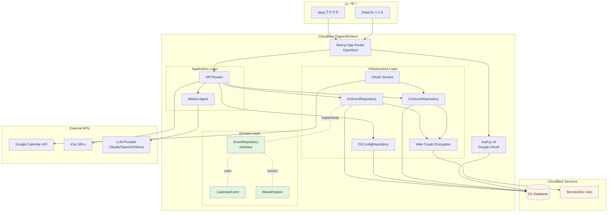
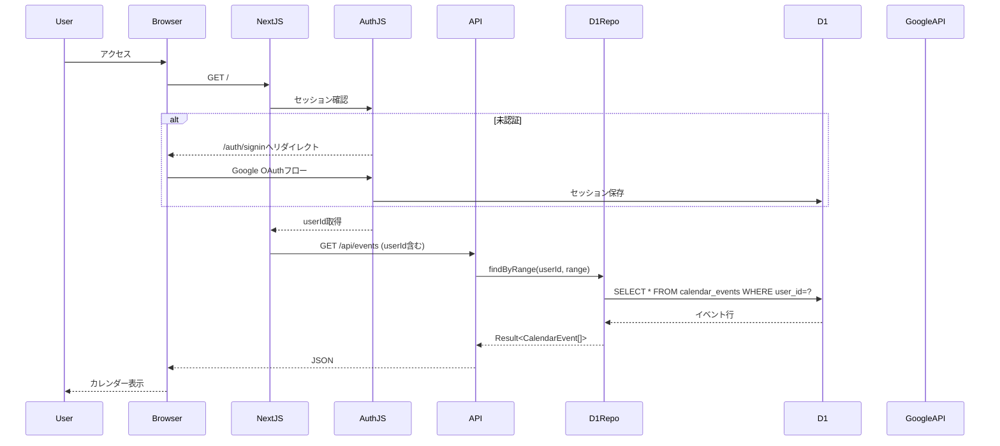
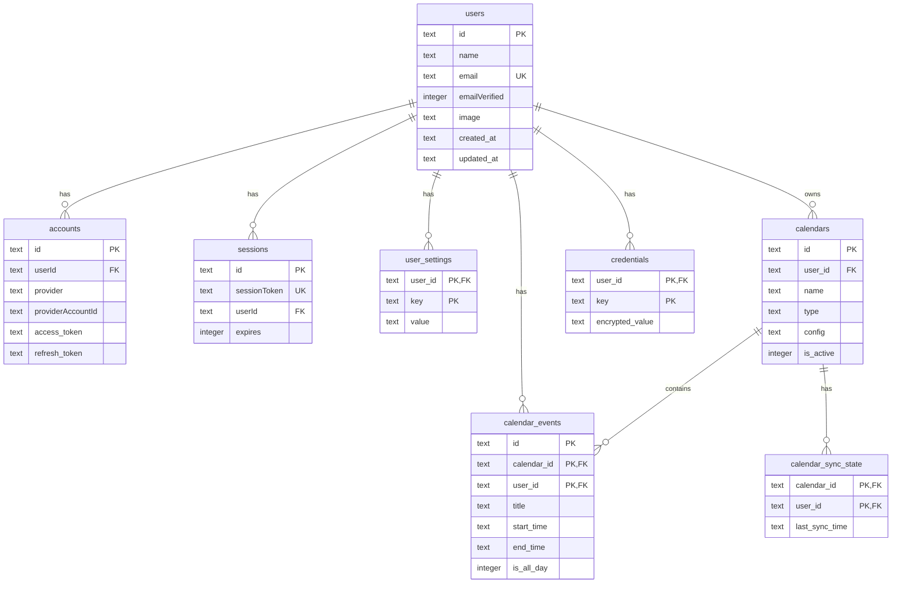

# Design Document: cloudflare-hosting

## Overview

SoloDayをローカル実行（npx）からCloudflare Pages/Workersでホスティングされるマルチユーザー対応SaaSへ移行する技術設計書です。

本移行の核心は以下の3点です。

1. **インフラ層の移行**: better-sqlite3 → D1、node:crypto → Web Crypto API、ファイルシステム → D1/KV
2. **マルチテナント化**: シングルユーザー → マルチユーザー（Auth.js v5 + D1アダプタ）
3. **既存コードの再利用**: ドメイン層は変更せず、インフラ層のみを差し替える

移行後もDDD、関数型プログラミング、Result型/Option型によるエラーハンドリング、リポジトリパターンといった既存のアーキテクチャ原則を維持します。

## ローカル開発環境

### DB戦略

ローカル開発では **Wrangler D1のローカルモード（Miniflare）** を使用します。`wrangler dev` を実行すると、MiniflareがローカルにSQLiteファイル（`.wrangler/state/v3/d1/`配下）を自動生成し、本番D1と同じAPIで操作できます。

```
ローカル開発: wrangler dev → Miniflare → ローカルSQLite（.wrangler/state/）
本番環境:     Cloudflare Workers → D1（クラウドSQLite）
```

**メリット:**
- 本番と同じD1 APIを使うためコード分岐が不要
- オフラインでも開発可能
- マイグレーションも同じSQLファイルで管理

### 開発サーバーの起動方法の変更

移行後、開発サーバーの起動コマンドが変更されます。

| 項目 | 移行前 | 移行後 |
|------|--------|--------|
| 開発サーバー起動 | `npm run dev` (next dev) | `npm run dev` (wrangler dev + OpenNext) |
| DBマイグレーション | 自動（起動時） | `npx wrangler d1 migrations apply soloday-db --local` |
| DB保存先 | `~/.soloday/db.sqlite` | `.wrangler/state/v3/d1/` |
| 環境変数 | `process.env` / `.env` | `.dev.vars`（Wrangler形式） |

### .dev.vars（ローカル開発用環境変数）

```
GOOGLE_CLIENT_ID=xxx
GOOGLE_CLIENT_SECRET=xxx
NEXTAUTH_SECRET=dev-secret
ENCRYPTION_KEY=dev-encryption-key
NEXTAUTH_URL=http://localhost:3333
```

> `.dev.vars` はWranglerが読み込むローカル専用の環境変数ファイルです。`.gitignore` に追加し、コミットしないでください。

## Steering Document Alignment

### Technical Standards (tech.md)

本設計は以下の技術標準に準拠します。

- **DDD（ドメイン駆動設計）**: ドメイン層をインフラ層から完全に分離。`lib/domain/calendar/`は変更不要
- **関数型プログラミング**: 純粋関数、イミュータブルなデータ構造、Result型/Option型の継続使用
- **リポジトリパターン**: `EventRepository`インターフェースはそのまま維持し、実装（SqliteEventRepository → D1EventRepository）のみ差し替え
- **依存性注入**: Cloudflare環境（D1、Secrets）への依存を明示的に管理し、テスタビリティを確保

### Project Structure (structure.md)

既存のディレクトリ構造を維持しつつ、以下の新規モジュールを追加します。

```
lib/
├── domain/                      # 変更なし
│   ├── calendar/                # カレンダードメインモデル（完全互換）
│   └── shared/                  # Result型、Option型（完全互換）
├── infrastructure/              # インフラ層（D1対応に変更）
│   ├── db/
│   │   ├── connection.ts        # D1Connection（新規）
│   │   ├── event-repository.ts  # D1EventRepository（非同期化）
│   │   ├── config-repository.ts # D1ConfigRepository（新規）
│   │   └── migrations/          # D1マイグレーション（Auth.js追加）
│   ├── crypto/
│   │   └── encryption.ts        # Web Crypto API対応（変更）
│   ├── secret/
│   │   └── secret-repository.ts # マルチテナント対応（変更）
│   ├── calendar/
│   │   ├── oauth-service.ts     # マルチテナント対応（変更）
│   │   └── token-store.ts       # D1ベーストークンストア（変更）
│   └── auth/                    # Auth.js設定（新規）
│       └── auth-config.ts
├── config/
│   ├── loader.ts                # D1設定ローダー（変更）
│   └── paths.ts                 # 削除（ファイルシステム依存）
└── context/                     # DIコンテキスト（新規）
    └── calendar-context.ts
```

## Code Reuse Analysis

### 完全再利用（変更不要）

以下のモジュールはCloudflare移行後もそのまま使用できます。

#### ドメイン層（lib/domain/）

- `lib/domain/calendar/entities/event.ts` - CalendarEventエンティティ
- `lib/domain/calendar/repository.ts` - EventRepositoryインターフェース
- `lib/domain/calendar/types.ts` - ドメイン型定義
- `lib/domain/shared/result.ts` - Result型
- `lib/domain/shared/option.ts` - Option型
- `lib/domain/shared/errors.ts` - ドメインエラー型

**理由**: これらはNode.js/Cloudflare環境に依存しない純粋なTypeScript型とロジックのため、移行不要です。

#### UIコンポーネント（app/、components/）

- すべてのReactコンポーネント（Panda CSS + Park UI）
- ダークモード対応
- レイアウト、ページコンポーネント

**理由**: Next.js App Routerはそのまま動作し、Cloudflare PagesではOpenNext経由でビルド可能です。

### 変更が必要（インターフェース維持、実装変更）

#### lib/infrastructure/db/connection.ts

**現在**: better-sqlite3のシングルトン接続管理

**変更後**: D1バインディングラッパー

- `initializeDatabase()` → `getD1Connection()`に変更
- マイグレーション管理は手動実行（`wrangler d1 migrations apply`）に変更

**再利用ポイント**: マイグレーションSQLファイルの構造は再利用可能（001_initial.sql等）

#### lib/infrastructure/db/event-repository.ts

**現在**: `SqliteEventRepository`（同期API）

**変更後**: `D1EventRepository`（非同期API）

- `EventRepository`インターフェースは変更なし
- `db.prepare().all()` → `await db.prepare().all()`
- トランザクションは `db.batch()` に変更

**再利用ポイント**: SQL文、行→エンティティ変換ロジックはそのまま再利用

#### lib/infrastructure/crypto/encryption.ts

**現在**: `node:crypto`を使用したAES-256-GCM暗号化

**変更後**: `Web Crypto API`を使用した暗号化

- `crypto.createCipheriv()` → `crypto.subtle.encrypt()`
- `crypto.randomBytes()` → `crypto.getRandomValues()`
- 関数シグネチャは維持（Result型ベース）

**再利用ポイント**: エラーハンドリング構造、serialize/deserialize関数のロジック

#### lib/infrastructure/secret/secret-repository.ts

**現在**: シングルユーザー前提のシークレット管理

**変更後**: マルチテナント対応

- `getSecret(key)` → `getSecret(userId, key)`
- `credentials`テーブルに`user_id`カラムを追加
- Auth.jsのセッションからユーザーIDを取得

**再利用ポイント**: 暗号化/復号化ロジック、Result型ベースのエラーハンドリング

#### lib/infrastructure/calendar/oauth-service.ts

**現在**: シングルユーザー前提のOAuth管理

**変更後**: マルチテナント対応

- トークンストアに`user_id`を追加
- `calendars`テーブルに`user_id`カラムを追加

**再利用ポイント**: OAuth 2.0フローロジック、リフレッシュトークン処理

### 新規作成

- `lib/infrastructure/auth/auth-config.ts` - Auth.js v5設定
- `lib/infrastructure/db/config-repository.ts` - D1ベース設定管理
- `lib/context/calendar-context.ts` - DIコンテキスト

## Architecture

### システムアーキテクチャ



### レイヤー分離

#### Domain Layer（変更なし）

- **CalendarEvent**: イベントエンティティ
- **EventRepository**: リポジトリインターフェース
- **Result/Option**: エラーハンドリング型

**依存**: なし（純粋TypeScript）

#### Infrastructure Layer（D1対応）

- **D1Connection**: D1バインディング管理
- **D1EventRepository**: D1ベースイベントリポジトリ
- **D1ConfigRepository**: D1ベース設定管理
- **D1SecretRepository**: マルチテナント対応シークレット管理
- **WebCryptoEncryption**: Web Crypto API暗号化
- **OAuthService**: マルチテナント対応OAuth管理

**依存**: Domain Layer、Cloudflare D1/Workers API

#### Application Layer

- **API Routes**: Next.js App Router APIエンドポイント
- **Mastra Agent**: AI質問応答

**依存**: Infrastructure Layer、Domain Layer

### データフロー



## Components and Interfaces

### 1. D1Connection

**目的**: D1データベースバインディングを管理

**インターフェース**:

```typescript
import type { D1Database } from '@cloudflare/workers-types';
import type { Result } from '@/lib/domain/shared';

/**
 * Next.js環境でD1バインディングを取得
 *
 * Cloudflare PagesではgetRequestContext().env.DBで取得
 */
export function getD1Connection(): Result<D1Database, DatabaseError>;

/**
 * マイグレーション実行（開発環境のみ）
 *
 * 本番環境では `wrangler d1 migrations apply` を使用
 */
export async function runMigrations(db: D1Database): Promise<Result<void, DatabaseError>>;
```

**依存**:
- `@cloudflare/workers-types`（型定義）
- `@cloudflare/next-on-pages`（バインディング取得）

**再利用**:
- マイグレーション管理ロジック（既存のマイグレーションファイル構造）

### 2. D1EventRepository

**目的**: D1を使用したEventRepositoryの実装（非同期API）

**インターフェース**:

```typescript
import type { D1Database } from '@cloudflare/workers-types';
import type { EventRepository } from '@/lib/domain/calendar/repository';
import type { CalendarEvent } from '@/lib/domain/calendar/entities/event';
import type { Result, Option } from '@/lib/domain/shared';
import type { CalendarId, TimeRange } from '@/lib/domain/shared/types';

/**
 * D1ベースイベントリポジトリ
 *
 * マルチテナント対応: すべてのメソッドにuserIdを追加
 */
export class D1EventRepository implements EventRepository {
  constructor(private readonly db: D1Database);

  /**
   * ユーザーの時間範囲でイベントを検索
   */
  async findByRange(
    userId: string,
    range: TimeRange,
  ): Promise<Result<CalendarEvent[], DbError>>;

  /**
   * ユーザーのカレンダーIDでイベントを検索
   */
  async findByCalendarId(
    userId: string,
    calendarId: CalendarId,
  ): Promise<Result<CalendarEvent[], DbError>>;

  /**
   * イベントを一括保存（upsert）
   */
  async saveMany(
    userId: string,
    events: CalendarEvent[],
  ): Promise<Result<void, DbError>>;

  /**
   * カレンダーのイベントを全削除
   */
  async deleteByCalendar(
    userId: string,
    calendarId: CalendarId,
  ): Promise<Result<void, DbError>>;

  /**
   * 最終同期時刻を取得
   */
  async getLastSyncTime(
    userId: string,
    calendarId: CalendarId,
  ): Promise<Result<Option<Date>, DbError>>;

  /**
   * 最終同期時刻を更新
   */
  async updateLastSyncTime(
    userId: string,
    calendarId: CalendarId,
    time: Date,
  ): Promise<Result<void, DbError>>;
}
```

**依存**:
- `@cloudflare/workers-types`
- `lib/domain/calendar/repository`（EventRepositoryインターフェース）
- `lib/domain/shared`（Result型、Option型）

**再利用**:
- 既存のSQL文（WHERE条件に`user_id = ?`を追加）
- 行→エンティティ変換ロジック（`rowToEvent`メソッド）

**変更点**:
- すべてのメソッドに`userId: string`パラメータを追加
- 同期API（`db.prepare().all()`）→ 非同期API（`await db.prepare().all()`）
- トランザクション（`db.transaction()`）→ バッチ処理（`await db.batch()`）

### 3. D1ConfigRepository

**目的**: D1を使用したアプリケーション設定管理

**インターフェース**:

```typescript
import type { D1Database } from '@cloudflare/workers-types';
import type { Result, Option } from '@/lib/domain/shared';

export interface UserSettings {
  llmProvider: 'anthropic' | 'openai' | 'ollama';
  llmModel: string;
  theme: 'light' | 'dark' | 'system';
}

/**
 * D1ベース設定リポジトリ
 */
export class D1ConfigRepository {
  constructor(private readonly db: D1Database);

  /**
   * ユーザー設定を取得
   */
  async getSettings(userId: string): Promise<Result<Option<UserSettings>, DbError>>;

  /**
   * ユーザー設定を保存
   */
  async saveSettings(userId: string, settings: UserSettings): Promise<Result<void, DbError>>;

  /**
   * 設定項目を個別取得
   */
  async getSetting<K extends keyof UserSettings>(
    userId: string,
    key: K,
  ): Promise<Result<Option<UserSettings[K]>, DbError>>;

  /**
   * 設定項目を個別保存
   */
  async setSetting<K extends keyof UserSettings>(
    userId: string,
    key: K,
    value: UserSettings[K],
  ): Promise<Result<void, DbError>>;
}
```

**依存**:
- `@cloudflare/workers-types`
- `lib/domain/shared`（Result型、Option型）

**再利用**:
- 既存の設定スキーマ（`settings`テーブル）に`user_id`を追加

### 4. D1SecretRepository

**目的**: マルチテナント対応の暗号化シークレット管理

**インターフェース**:

```typescript
import type { D1Database } from '@cloudflare/workers-types';
import type { Result, Option } from '@/lib/domain/shared';

/**
 * マルチテナント対応シークレットリポジトリ
 */
export class D1SecretRepository {
  constructor(
    private readonly db: D1Database,
    private readonly encryptionKey: CryptoKey,
  );

  /**
   * ユーザーのシークレットを取得
   */
  async getSecret(
    userId: string,
    key: string,
  ): Promise<Result<Option<string>, SecretError>>;

  /**
   * ユーザーのシークレットを保存
   */
  async setSecret(
    userId: string,
    key: string,
    value: string,
  ): Promise<Result<void, SecretError>>;

  /**
   * ユーザーのシークレットを削除
   */
  async deleteSecret(
    userId: string,
    key: string,
  ): Promise<Result<void, SecretError>>;

  /**
   * ユーザーのシークレットが存在するか確認
   */
  async hasSecret(
    userId: string,
    key: string,
  ): Promise<Result<boolean, SecretError>>;
}
```

**依存**:
- `@cloudflare/workers-types`
- `lib/infrastructure/crypto`（Web Crypto API暗号化）
- `lib/domain/shared`（Result型、Option型）

**再利用**:
- 既存の暗号化/復号化ロジック
- `credentials`テーブルに`user_id`カラムを追加

**変更点**:
- すべてのメソッドに`userId: string`パラメータを追加
- SQL文に`WHERE user_id = ?`条件を追加

### 5. WebCryptoEncryption

**目的**: Web Crypto APIを使用したAES-256-GCM暗号化

**インターフェース**:

```typescript
import type { Result } from '@/lib/domain/shared';

/**
 * 暗号化データ構造
 */
export interface EncryptedData {
  iv: Uint8Array;
  authTag: Uint8Array;
  ciphertext: Uint8Array;
}

/**
 * 暗号化キーを環境変数から取得してインポート
 */
export async function getEncryptionKey(): Promise<Result<CryptoKey, CryptoError>>;

/**
 * 文字列をAES-256-GCMで暗号化
 */
export async function encrypt(
  plaintext: string,
  key: CryptoKey,
): Promise<Result<EncryptedData, CryptoError>>;

/**
 * AES-256-GCM暗号化データを復号化
 */
export async function decrypt(
  encrypted: EncryptedData,
  key: CryptoKey,
): Promise<Result<string, CryptoError>>;

/**
 * 暗号化データをBase64文字列にシリアライズ
 */
export function serialize(data: EncryptedData): string;

/**
 * Base64文字列から暗号化データをデシリアライズ
 */
export function deserialize(base64: string): EncryptedData;
```

**依存**:
- `Web Crypto API`（グローバル`crypto.subtle`）
- `lib/domain/shared`（Result型）

**再利用**:
- 既存のserialize/deserializeロジック
- エラーハンドリング構造

**変更点**:
- `node:crypto` → `Web Crypto API`
- `Buffer` → `Uint8Array`
- 関数を非同期化（`crypto.subtle`は非同期API）

### 6. AuthConfig

**目的**: Auth.js v5の設定（Google OAuthプロバイダ + D1アダプタ）

**インターフェース**:

```typescript
import type { NextAuthConfig } from 'next-auth';
import Google from 'next-auth/providers/google';
import { D1Adapter } from '@auth/d1-adapter';
import type { D1Database } from '@cloudflare/workers-types';

/**
 * Auth.js v5設定を生成
 */
export function createAuthConfig(db: D1Database): NextAuthConfig;
```

**実装例**:

```typescript
export function createAuthConfig(db: D1Database): NextAuthConfig {
  return {
    adapter: D1Adapter(db),
    providers: [
      Google({
        clientId: process.env.GOOGLE_OAUTH_CLIENT_ID!,
        clientSecret: process.env.GOOGLE_OAUTH_CLIENT_SECRET!,
      }),
    ],
    session: {
      strategy: 'database',
    },
    callbacks: {
      async session({ session, user }) {
        if (session.user) {
          session.user.id = user.id;
        }
        return session;
      },
    },
  };
}
```

**依存**:
- `next-auth`
- `@auth/d1-adapter`
- `next-auth/providers/google`

### 7. CalendarContext

**目的**: 依存性注入コンテキスト（リポジトリのインスタンス管理）

**インターフェース**:

```typescript
import type { D1Database } from '@cloudflare/workers-types';
import type { EventRepository } from '@/lib/domain/calendar/repository';

/**
 * カレンダーコンテキスト（DIコンテナ）
 */
export interface CalendarContext {
  eventRepository: EventRepository;
  configRepository: D1ConfigRepository;
  secretRepository: D1SecretRepository;
}

/**
 * D1から最カレンダーコンテキストを作成
 */
export async function createCalendarContext(
  db: D1Database,
): Promise<Result<CalendarContext, Error>>;
```

**実装例**:

```typescript
export async function createCalendarContext(
  db: D1Database,
): Promise<Result<CalendarContext, Error>> {
  const keyResult = await getEncryptionKey();
  if (keyResult._tag === 'Err') {
    return err(new Error('暗号化キーの取得に失敗しました'));
  }

  return ok({
    eventRepository: new D1EventRepository(db),
    configRepository: new D1ConfigRepository(db),
    secretRepository: new D1SecretRepository(db, keyResult.value),
  });
}
```

**依存**:
- すべてのリポジトリ実装

## Data Models

### D1スキーマ設計（マルチテナント対応）

#### Auth.js標準テーブル

```sql
-- ユーザーテーブル（Auth.js標準）
CREATE TABLE IF NOT EXISTS users (
  id TEXT PRIMARY KEY NOT NULL,
  name TEXT,
  email TEXT NOT NULL UNIQUE,
  emailVerified INTEGER,
  image TEXT,
  created_at TEXT NOT NULL DEFAULT (datetime('now')),
  updated_at TEXT NOT NULL DEFAULT (datetime('now'))
);

-- アカウントテーブル（Auth.js標準）
-- OAuthプロバイダ情報を保存
CREATE TABLE IF NOT EXISTS accounts (
  id TEXT PRIMARY KEY NOT NULL,
  userId TEXT NOT NULL,
  type TEXT NOT NULL,
  provider TEXT NOT NULL,
  providerAccountId TEXT NOT NULL,
  refresh_token TEXT,
  access_token TEXT,
  expires_at INTEGER,
  token_type TEXT,
  scope TEXT,
  id_token TEXT,
  session_state TEXT,
  created_at TEXT NOT NULL DEFAULT (datetime('now')),
  updated_at TEXT NOT NULL DEFAULT (datetime('now')),
  FOREIGN KEY (userId) REFERENCES users(id) ON DELETE CASCADE
);

CREATE INDEX IF NOT EXISTS idx_accounts_userId ON accounts(userId);

-- セッションテーブル（Auth.js標準）
CREATE TABLE IF NOT EXISTS sessions (
  id TEXT PRIMARY KEY NOT NULL,
  sessionToken TEXT NOT NULL UNIQUE,
  userId TEXT NOT NULL,
  expires INTEGER NOT NULL,
  created_at TEXT NOT NULL DEFAULT (datetime('now')),
  updated_at TEXT NOT NULL DEFAULT (datetime('now')),
  FOREIGN KEY (userId) REFERENCES users(id) ON DELETE CASCADE
);

CREATE INDEX IF NOT EXISTS idx_sessions_userId ON sessions(userId);

-- 検証トークンテーブル（Auth.js標準）
CREATE TABLE IF NOT EXISTS verification_tokens (
  identifier TEXT NOT NULL,
  token TEXT NOT NULL UNIQUE,
  expires INTEGER NOT NULL,
  PRIMARY KEY (identifier, token)
);
```

#### SoloDay固有テーブル（マルチテナント対応）

```sql
-- ユーザー設定テーブル
CREATE TABLE IF NOT EXISTS user_settings (
  user_id TEXT NOT NULL,
  key TEXT NOT NULL,
  value TEXT NOT NULL,
  updated_at TEXT NOT NULL DEFAULT (datetime('now')),
  PRIMARY KEY (user_id, key),
  FOREIGN KEY (user_id) REFERENCES users(id) ON DELETE CASCADE
);

CREATE INDEX IF NOT EXISTS idx_user_settings_user_id ON user_settings(user_id);

-- カレンダーテーブル（マルチテナント対応）
CREATE TABLE IF NOT EXISTS calendars (
  id TEXT PRIMARY KEY NOT NULL,
  user_id TEXT NOT NULL,
  name TEXT NOT NULL,
  type TEXT NOT NULL, -- 'google' | 'ical'
  config TEXT NOT NULL, -- JSON形式の設定
  is_active INTEGER NOT NULL DEFAULT 1,
  created_at TEXT NOT NULL DEFAULT (datetime('now')),
  updated_at TEXT NOT NULL DEFAULT (datetime('now')),
  FOREIGN KEY (user_id) REFERENCES users(id) ON DELETE CASCADE
);

CREATE INDEX IF NOT EXISTS idx_calendars_user_id ON calendars(user_id);

-- カレンダーイベントキャッシュテーブル（マルチテナント対応）
CREATE TABLE IF NOT EXISTS calendar_events (
  id TEXT NOT NULL,
  calendar_id TEXT NOT NULL,
  user_id TEXT NOT NULL,
  title TEXT NOT NULL,
  start_time TEXT NOT NULL,
  end_time TEXT NOT NULL,
  is_all_day INTEGER NOT NULL DEFAULT 0,
  location TEXT,
  description TEXT,
  source_type TEXT NOT NULL,
  source_calendar_name TEXT NOT NULL,
  source_account_email TEXT,
  created_at TEXT NOT NULL DEFAULT (datetime('now')),
  updated_at TEXT NOT NULL DEFAULT (datetime('now')),
  PRIMARY KEY (id, calendar_id, user_id),
  FOREIGN KEY (user_id) REFERENCES users(id) ON DELETE CASCADE,
  FOREIGN KEY (calendar_id) REFERENCES calendars(id) ON DELETE CASCADE
);

CREATE INDEX IF NOT EXISTS idx_calendar_events_user_time_range
  ON calendar_events(user_id, start_time, end_time);
CREATE INDEX IF NOT EXISTS idx_calendar_events_calendar_id
  ON calendar_events(calendar_id);

-- カレンダー同期状態テーブル（マルチテナント対応）
CREATE TABLE IF NOT EXISTS calendar_sync_state (
  calendar_id TEXT NOT NULL,
  user_id TEXT NOT NULL,
  last_sync_time TEXT NOT NULL,
  updated_at TEXT NOT NULL DEFAULT (datetime('now')),
  PRIMARY KEY (calendar_id, user_id),
  FOREIGN KEY (user_id) REFERENCES users(id) ON DELETE CASCADE,
  FOREIGN KEY (calendar_id) REFERENCES calendars(id) ON DELETE CASCADE
);

-- 認証情報テーブル（マルチテナント対応）
CREATE TABLE IF NOT EXISTS credentials (
  user_id TEXT NOT NULL,
  key TEXT NOT NULL,
  encrypted_value TEXT NOT NULL,
  created_at TEXT NOT NULL DEFAULT (datetime('now')),
  updated_at TEXT NOT NULL DEFAULT (datetime('now')),
  PRIMARY KEY (user_id, key),
  FOREIGN KEY (user_id) REFERENCES users(id) ON DELETE CASCADE
);

CREATE INDEX IF NOT EXISTS idx_credentials_user_id ON credentials(user_id);

-- マイグレーション管理テーブル
CREATE TABLE IF NOT EXISTS migrations (
  id INTEGER PRIMARY KEY,
  name TEXT NOT NULL UNIQUE,
  executed_at TEXT NOT NULL DEFAULT (datetime('now'))
);
```

#### マルチテナント対応の要点

1. **すべてのテーブルに`user_id`を追加**: カレンダー、イベント、設定、認証情報
2. **外部キー制約**: `FOREIGN KEY (user_id) REFERENCES users(id) ON DELETE CASCADE`
3. **複合プライマリキー**: `(user_id, key)`、`(id, calendar_id, user_id)`
4. **インデックス**: `user_id`を含む複合インデックスでクエリ最適化

### データ関係図



## Error Handling

### エラーシナリオと対策

#### 1. D1接続エラー

**シナリオ**: D1バインディングが取得できない（環境変数未設定、Cloudflare外での実行）

**ハンドリング**:

```typescript
const dbResult = getD1Connection();
if (dbResult._tag === 'Err') {
  console.error('[D1接続エラー]', dbResult.error.message);
  return new Response('データベースに接続できません', { status: 500 });
}
```

**ユーザー影響**: 500エラー画面「現在メンテナンス中です」

**対策**:
- 開発環境では`wrangler dev`を使用
- 本番環境ではヘルスチェックエンドポイントでD1接続を監視

#### 2. Auth.jsセッションエラー

**シナリオ**: セッションが期限切れ、または不正

**ハンドリング**:

```typescript
const session = await getServerSession(authConfig);
if (!session || !session.user) {
  return redirect('/auth/signin');
}
```

**ユーザー影響**: ログイン画面へリダイレクト

**対策**:
- セッション有効期限を30日に設定
- 自動ログアウト前に警告を表示

#### 3. Web Crypto API暗号化エラー

**シナリオ**: 暗号化キーが不正、または暗号化/復号化に失敗

**ハンドリング**:

```typescript
const keyResult = await getEncryptionKey();
if (keyResult._tag === 'Err') {
  console.error('[暗号化キーエラー]', keyResult.error.message);
  return new Response('暗号化の設定に問題があります', { status: 500 });
}

const decryptResult = await decrypt(encrypted, key);
if (decryptResult._tag === 'Err') {
  console.error('[復号化エラー]', decryptResult.error.message);
  // 暗号化データを削除して再認証を促す
  await secretRepo.deleteSecret(userId, key);
  return new Response('認証情報が無効です。再度ログインしてください', { status: 401 });
}
```

**ユーザー影響**: エラーメッセージ表示、再認証が必要

**対策**:
- Cloudflare Secretsで暗号化キーを厳重管理
- 暗号化キーのローテーション機能を実装（将来）

#### 4. Google Calendar API エラー

**シナリオ**: トークン期限切れ、API制限、ネットワークエラー

**ハンドリング**:

```typescript
// トークン期限切れ
if (response.status === 401) {
  // リフレッシュトークンで再取得
  const refreshResult = await refreshAccessToken(userId, calendarId);
  if (refreshResult._tag === 'Ok') {
    // リトライ
    return fetchEvents(userId, calendarId);
  } else {
    // 再認証が必要
    return err(oauthTokenExpired('Google Calendarの再認証が必要です'));
  }
}

// API制限
if (response.status === 429) {
  // 指数バックオフでリトライ
  await exponentialBackoff(retryCount);
  return fetchEvents(userId, calendarId);
}

// その他のエラー
if (!response.ok) {
  return err(apiError(`Google Calendar APIエラー: ${response.statusText}`));
}
```

**ユーザー影響**: エラーメッセージ表示、再認証リンク提供

**対策**:
- リフレッシュトークンの自動更新
- API制限時の指数バックオフリトライ
- キャッシュからのフォールバック表示

#### 5. D1クエリエラー

**シナリオ**: SQL構文エラー、制約違反、トランザクションエラー

**ハンドリング**:

```typescript
try {
  const result = await db.prepare(sql).bind(...params).all();
  return ok(result.results);
} catch (error) {
  console.error('[D1クエリエラー]', sql, error);
  return err(dbQueryError('イベント取得に失敗しました', sql, error));
}
```

**ユーザー影響**: エラーメッセージ表示「データの取得に失敗しました」

**対策**:
- 開発環境でSQLのバリデーション
- 制約違反時の適切なエラーメッセージ
- トランザクションのロールバック

#### 6. Mastra Agentエラー

**シナリオ**: LLM APIエラー、タイムアウト、レート制限

**ハンドリング**:

```typescript
try {
  const response = await agent.generate(prompt, { timeout: 10000 });
  return ok(response.text);
} catch (error) {
  if (error instanceof TimeoutError) {
    return err(aiTimeout('AI応答がタイムアウトしました。もう一度お試しください。'));
  }
  if (error instanceof RateLimitError) {
    return err(aiRateLimit('現在リクエストが集中しています。しばらくお待ちください。'));
  }
  return err(aiError('AI応答の生成に失敗しました'));
}
```

**ユーザー影響**: エラーメッセージ表示、リトライボタン

**対策**:
- タイムアウト設定（10秒）
- レート制限時の待機時間表示
- フォールバック応答（「現在応答できません」）

## Testing Strategy

### Unit Testing

**対象**: ドメイン層、インフラ層のビジネスロジック

**ツール**: Vitest

**アプローチ**:

```typescript
// lib/infrastructure/crypto/encryption.test.ts
import { describe, it, expect } from 'vitest';
import { encrypt, decrypt, serialize, deserialize } from './encryption';

describe('Web Crypto Encryption', () => {
  it('暗号化→復号化が正しく動作する', async () => {
    const key = await crypto.subtle.generateKey(
      { name: 'AES-GCM', length: 256 },
      true,
      ['encrypt', 'decrypt']
    );

    const plaintext = '機密データ';
    const encryptResult = await encrypt(plaintext, key);
    expect(encryptResult._tag).toBe('Ok');

    const decryptResult = await decrypt(encryptResult.value, key);
    expect(decryptResult._tag).toBe('Ok');
    expect(decryptResult.value).toBe(plaintext);
  });

  it('serialize→deserializeが正しく動作する', async () => {
    const key = await crypto.subtle.generateKey(
      { name: 'AES-GCM', length: 256 },
      true,
      ['encrypt', 'decrypt']
    );

    const encryptResult = await encrypt('テスト', key);
    const serialized = serialize(encryptResult.value);
    const deserialized = deserialize(serialized);

    expect(deserialized.iv).toEqual(encryptResult.value.iv);
    expect(deserialized.authTag).toEqual(encryptResult.value.authTag);
    expect(deserialized.ciphertext).toEqual(encryptResult.value.ciphertext);
  });
});
```

**テスト対象**:
- 暗号化/復号化ロジック
- Result型エラーハンドリング
- ドメインエンティティのビジネスロジック

### Integration Testing

**対象**: リポジトリとD1の統合、API Routes

**ツール**: Vitest + Cloudflare Miniflare（D1モック）

**アプローチ**:

```typescript
// lib/infrastructure/db/event-repository.test.ts
import { describe, it, expect, beforeEach } from 'vitest';
import { unstable_dev } from 'wrangler';
import { D1EventRepository } from './event-repository';
import { createCalendarEvent } from '@/lib/domain/calendar/entities/event';

describe('D1EventRepository', () => {
  let db: D1Database;
  let repo: D1EventRepository;

  beforeEach(async () => {
    // Miniflareを使用してD1をモック
    const worker = await unstable_dev('app/api/test/route.ts', {
      experimental: { disableExperimentalWarning: true },
    });
    db = worker.env.DB;
    repo = new D1EventRepository(db);
  });

  it('イベントを保存して取得できる', async () => {
    const userId = 'test-user-id';
    const event = createCalendarEvent({
      id: 'event-1',
      calendarId: 'cal-1',
      title: 'テストイベント',
      startTime: new Date('2026-02-06T10:00:00'),
      endTime: new Date('2026-02-06T11:00:00'),
      isAllDay: false,
      source: { type: 'google', calendarName: 'テストカレンダー' },
    });

    const saveResult = await repo.saveMany(userId, [event]);
    expect(saveResult._tag).toBe('Ok');

    const findResult = await repo.findByRange(userId, {
      start: new Date('2026-02-06T00:00:00'),
      end: new Date('2026-02-06T23:59:59'),
    });
    expect(findResult._tag).toBe('Ok');
    expect(findResult.value).toHaveLength(1);
    expect(findResult.value[0].title).toBe('テストイベント');
  });

  it('マルチテナント分離が機能する', async () => {
    const user1 = 'user-1';
    const user2 = 'user-2';
    const event1 = createCalendarEvent({ /* user1のイベント */ });
    const event2 = createCalendarEvent({ /* user2のイベント */ });

    await repo.saveMany(user1, [event1]);
    await repo.saveMany(user2, [event2]);

    const user1Result = await repo.findByRange(user1, range);
    expect(user1Result.value).toHaveLength(1);

    const user2Result = await repo.findByRange(user2, range);
    expect(user2Result.value).toHaveLength(1);
  });
});
```

**テスト対象**:
- D1リポジトリの動作
- マルチテナント分離
- トランザクション処理

### End-to-End Testing

**対象**: ユーザーフロー全体

**ツール**: Playwright

**アプローチ**:

```typescript
// e2e/auth-flow.spec.ts
import { test, expect } from '@playwright/test';

test('認証フロー', async ({ page }) => {
  // 未認証状態でアクセス
  await page.goto('http://localhost:3000');

  // ログイン画面にリダイレクトされる
  await expect(page).toHaveURL(/\/auth\/signin/);

  // Google OAuthボタンをクリック
  await page.click('button:has-text("Sign in with Google")');

  // （モック）Google認証画面で承認
  // ...

  // メイン画面に遷移
  await expect(page).toHaveURL('http://localhost:3000');

  // カレンダーが表示される
  await expect(page.locator('article')).toBeVisible();
});

test('カレンダー追加フロー', async ({ page, context }) => {
  // ログイン済みセッションを設定
  await context.addCookies([/* セッションクッキー */]);

  await page.goto('http://localhost:3000/setup');

  // Google Calendarを追加
  await page.click('button:has-text("Google Calendarを追加")');

  // OAuth認証（モック）
  // ...

  // カレンダーが追加される
  await expect(page.locator('text=カレンダーが追加されました')).toBeVisible();

  // メイン画面に戻る
  await page.goto('http://localhost:3000');

  // 追加したカレンダーのイベントが表示される
  await expect(page.locator('article')).toContainText('テストイベント');
});
```

**テスト対象**:
- 認証フロー（Google OAuth）
- カレンダー追加フロー
- イベント表示
- AI質問応答
- ダークモード切り替え

### テスト環境

#### ローカル開発

```bash
# D1マイグレーション適用
npx wrangler d1 migrations apply soloday-db --local

# 開発サーバー起動（Miniflare使用）
npx wrangler dev

# テスト実行
npm run test        # Unitテスト
npm run test:e2e    # E2Eテスト
```

#### CI/CD（GitHub Actions）

```yaml
name: Test

on: [push, pull_request]

jobs:
  test:
    runs-on: ubuntu-latest
    steps:
      - uses: actions/checkout@v4
      - uses: actions/setup-node@v4
        with:
          node-version: 20

      # Unitテスト
      - run: npm ci
      - run: npm run test

      # E2Eテスト（Playwrightインストール）
      - run: npx playwright install --with-deps
      - run: npm run test:e2e

      # カバレッジレポート
      - uses: codecov/codecov-action@v3
```

### テストカバレッジ目標

- **Unit Tests**: 80%以上（ドメイン層、インフラ層）
- **Integration Tests**: 主要なリポジトリとAPI Routes
- **E2E Tests**: 主要ユーザーフロー（認証、カレンダー追加、イベント表示、AI質問）
