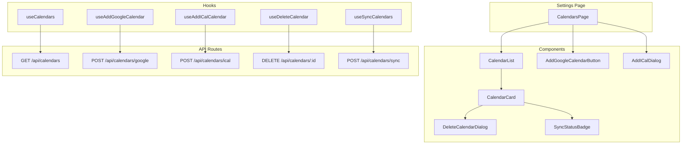

# Design Document - calendar-management-ui

## Overview

カレンダー管理UIの技術設計。セットアップ完了後に利用可能なカレンダー設定画面を実装し、calendar-integration APIと連携する。既存のSetupClientWrapperパターンとPark UIコンポーネントを活用する。

## Steering Document Alignment

### Technical Standards (CLAUDE.md)

- **UXファースト**: シンプルで直感的なUI、情報過多にしない
- **Park UI + Panda CSS**: 既存のデザインシステムに従う
- **DDD**: APIコールはカスタムフックで抽象化

### Project Structure (CLAUDE.md)

```
components/
└── calendar/            # カレンダー管理コンポーネント
    ├── CalendarList.tsx
    ├── CalendarCard.tsx
    ├── AddGoogleCalendarButton.tsx
    ├── AddICalDialog.tsx
    ├── DeleteCalendarDialog.tsx
    └── index.ts
app/
└── settings/
    └── calendars/
        └── page.tsx     # カレンダー設定ページ
```

## Code Reuse Analysis

### Existing Components to Leverage

- **ProviderCard パターン**: CalendarCardのベースとして活用（ボタン/カード、選択状態表示）
- **ApiKeyForm パターン**: iCal URL入力フォームのベースとして活用（バリデーション、エラー表示）
- **SetupStepper**: 設定画面のナビゲーション参考
- **Panda CSS css()**: 全スタイリングに使用

### Integration Points

- **calendar-integration API**: `/api/calendars/*` エンドポイントと連携
- **lib/config**: CalendarConfig型を使用
- **Park UI Dialog**: モーダルダイアログに使用

## Architecture



### Modular Design Principles

- **Single File Responsibility**: 各コンポーネントは1つの責務（リスト、カード、ダイアログ）
- **Component Isolation**: ダイアログは独立コンポーネント、状態は親が管理
- **Service Layer Separation**: APIコールはカスタムフックに分離
- **Utility Modularity**: 日付フォーマット等はユーティリティ関数として切り出し

## Components and Interfaces

### CalendarsPage

- **Purpose**: カレンダー設定画面のメインページ
- **Location**: `app/settings/calendars/page.tsx`
- **Interfaces**: Server Component、クライアントコンポーネントをラップ

```typescript
export default function CalendarsPage() {
  return (
    <div>
      <Header title="カレンダー設定" />
      <CalendarsClientWrapper />
    </div>
  );
}
```

### CalendarsClientWrapper

- **Purpose**: クライアント状態管理とコンポーネント構成
- **Location**: `components/calendar/CalendarsClientWrapper.tsx`
- **Interfaces**:
  - カレンダー一覧の取得・表示
  - 追加/削除ダイアログの開閉状態管理

### CalendarList

- **Purpose**: 登録済みカレンダーの一覧表示
- **Location**: `components/calendar/CalendarList.tsx`
- **Props**:
  ```typescript
  interface CalendarListProps {
    calendars: CalendarConfig[];
    onToggle: (id: CalendarId, enabled: boolean) => void;
    onDelete: (id: CalendarId) => void;
    onSync: () => void;
    isSyncing: boolean;
    lastSyncTime?: Date;
  }
  ```
- **Reuses**: ProviderCardのグリッドレイアウトパターン

### CalendarCard

- **Purpose**: 個別カレンダーの表示・操作
- **Location**: `components/calendar/CalendarCard.tsx`
- **Props**:
  ```typescript
  interface CalendarCardProps {
    calendar: CalendarConfig;
    onToggle: (enabled: boolean) => void;
    onDelete: () => void;
  }
  ```
- **Reuses**: ProviderCardのスタイリングパターン

### AddGoogleCalendarButton

- **Purpose**: Google OAuth認証開始ボタン
- **Location**: `components/calendar/AddGoogleCalendarButton.tsx`
- **Props**:
  ```typescript
  interface AddGoogleCalendarButtonProps {
    onSuccess: () => void;
    onError: (error: string) => void;
  }
  ```

### AddICalDialog

- **Purpose**: iCal URL入力ダイアログ
- **Location**: `components/calendar/AddICalDialog.tsx`
- **Props**:
  ```typescript
  interface AddICalDialogProps {
    isOpen: boolean;
    onClose: () => void;
    onSubmit: (url: string, name?: string) => Promise<void>;
  }
  ```
- **Reuses**: ApiKeyFormの入力・バリデーションパターン、Park UI Dialog

### DeleteCalendarDialog

- **Purpose**: カレンダー削除確認ダイアログ
- **Location**: `components/calendar/DeleteCalendarDialog.tsx`
- **Props**:
  ```typescript
  interface DeleteCalendarDialogProps {
    isOpen: boolean;
    calendar: CalendarConfig | null;
    onClose: () => void;
    onConfirm: () => Promise<void>;
  }
  ```
- **Reuses**: Park UI Dialog

### SyncStatusBadge

- **Purpose**: 同期状態のバッジ表示
- **Location**: `components/calendar/SyncStatusBadge.tsx`
- **Props**:
  ```typescript
  interface SyncStatusBadgeProps {
    lastSyncTime?: Date;
    hasError?: boolean;
  }
  ```

## Custom Hooks

### useCalendars

- **Purpose**: カレンダー一覧の取得・キャッシュ
- **Location**: `hooks/useCalendars.ts`

```typescript
interface UseCalendarsReturn {
  calendars: CalendarConfig[];
  isLoading: boolean;
  error: string | null;
  refetch: () => Promise<void>;
  toggleCalendar: (id: CalendarId, enabled: boolean) => Promise<void>;
}
```

### useAddGoogleCalendar

- **Purpose**: Google OAuth フロー管理
- **Location**: `hooks/useAddGoogleCalendar.ts`

```typescript
interface UseAddGoogleCalendarReturn {
  startAuth: () => Promise<void>;
  isLoading: boolean;
  error: string | null;
}
```

### useAddICalCalendar

- **Purpose**: iCalカレンダー追加
- **Location**: `hooks/useAddICalCalendar.ts`

```typescript
interface UseAddICalCalendarReturn {
  addCalendar: (url: string, name?: string) => Promise<void>;
  isLoading: boolean;
  error: string | null;
}
```

### useDeleteCalendar

- **Purpose**: カレンダー削除
- **Location**: `hooks/useDeleteCalendar.ts`

```typescript
interface UseDeleteCalendarReturn {
  deleteCalendar: (id: CalendarId) => Promise<void>;
  isLoading: boolean;
  error: string | null;
}
```

### useSyncCalendars

- **Purpose**: カレンダー同期
- **Location**: `hooks/useSyncCalendars.ts`

```typescript
interface UseSyncCalendarsReturn {
  sync: () => Promise<void>;
  isSyncing: boolean;
  lastSyncTime?: Date;
  error: string | null;
}
```

## Data Models

### CalendarConfig (既存)

```typescript
interface CalendarConfig {
  readonly id: CalendarId;
  readonly type: 'google' | 'ical';
  readonly name: string;
  readonly enabled: boolean;
  readonly color?: string;
  readonly googleAccountEmail?: string;
  readonly googleCalendarId?: string;
  readonly icalUrl?: string;
}
```

### CalendarListResponse

```typescript
interface CalendarListResponse {
  calendars: CalendarConfig[];
}
```

### SyncResponse

```typescript
interface SyncResponse {
  success: boolean;
  syncedAt: string;
  successCount: number;
  errorCalendars: Array<{
    id: string;
    name: string;
    error: string;
  }>;
}
```

## UI Design

### カレンダー設定画面レイアウト

```
┌────────────────────────────────────────────────────┐
│  ← 戻る        カレンダー設定           [同期] 🔄  │
├────────────────────────────────────────────────────┤
│                                                     │
│  [+ Googleカレンダーを追加]  [+ iCalを追加]        │
│                                                     │
│  ┌──────────────────────────────────────────────┐  │
│  │ 🔵 Google  仕事用カレンダー          [ON] 🗑 │  │
│  │    user@gmail.com                            │  │
│  │    最終同期: 5分前                           │  │
│  └──────────────────────────────────────────────┘  │
│                                                     │
│  ┌──────────────────────────────────────────────┐  │
│  │ 🟢 Google  個人カレンダー            [ON] 🗑 │  │
│  │    personal@gmail.com                        │  │
│  │    最終同期: 5分前                           │  │
│  └──────────────────────────────────────────────┘  │
│                                                     │
│  ┌──────────────────────────────────────────────┐  │
│  │ 📅 iCal   日本の祝日                [OFF] 🗑 │  │
│  │    同期エラー ⚠️                             │  │
│  └──────────────────────────────────────────────┘  │
│                                                     │
└────────────────────────────────────────────────────┘
```

### iCal追加ダイアログ

```
┌────────────────────────────────────┐
│  iCalカレンダーを追加         ✕   │
├────────────────────────────────────┤
│                                    │
│  iCal URL *                        │
│  ┌────────────────────────────┐   │
│  │ https://...                │   │
│  └────────────────────────────┘   │
│                                    │
│  カレンダー名（任意）              │
│  ┌────────────────────────────┐   │
│  │ 日本の祝日                 │   │
│  └────────────────────────────┘   │
│                                    │
│       [キャンセル]  [追加]        │
└────────────────────────────────────┘
```

## Error Handling

### Error Scenarios

1. **カレンダー一覧取得失敗**
   - Handling: エラーメッセージ表示、リトライボタン
   - User Impact: 「カレンダーの読み込みに失敗しました。再試行してください。」

2. **Google OAuth 失敗**
   - Handling: エラーメッセージ表示
   - User Impact: 「Googleカレンダーの認証に失敗しました。もう一度お試しください。」

3. **iCal URL 無効**
   - Handling: 入力欄下にエラー表示
   - User Impact: 「無効なURLです。有効なiCal URLを入力してください。」

4. **同期失敗**
   - Handling: 失敗したカレンダーをハイライト、詳細表示
   - User Impact: 「一部のカレンダーの同期に失敗しました。」

5. **削除失敗**
   - Handling: エラートースト表示
   - User Impact: 「カレンダーの削除に失敗しました。」

## Navigation

### ルーティング

- `/settings/calendars` - カレンダー設定画面
- `/settings/calendars?calendar=success` - Google OAuth成功後のリダイレクト
- `/settings/calendars?calendar=error` - Google OAuth失敗後のリダイレクト

### セットアップ完了後の遷移

SetupComplete コンポーネントに「カレンダーを設定」ボタンを追加し、`/settings/calendars` へ遷移可能にする。

## Testing Strategy

### Unit Testing

- カスタムフックのテスト（モックAPI使用）
- コンポーネントのレンダリングテスト
- トグル・削除のインタラクションテスト

### Integration Testing

- API呼び出しとUI更新の連携テスト
- OAuth コールバック処理のテスト

### End-to-End Testing（手動）

- Googleカレンダー追加フロー
- iCalカレンダー追加フロー
- カレンダー削除フロー
- 同期フロー

## Dependencies

### npm packages

既存パッケージを使用（追加なし）:
- `@ark-ui/react` - Dialog コンポーネント
- `@park-ui/panda-preset` - スタイリング

### 新規作成が必要なPark UIコンポーネント

- `components/ui/dialog.tsx` - Park UI Dialog ラッパー
- `components/ui/switch.tsx` - Park UI Switch（トグル）ラッパー
